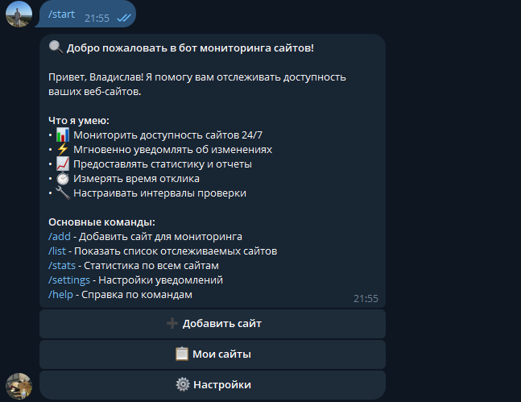
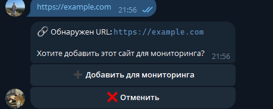
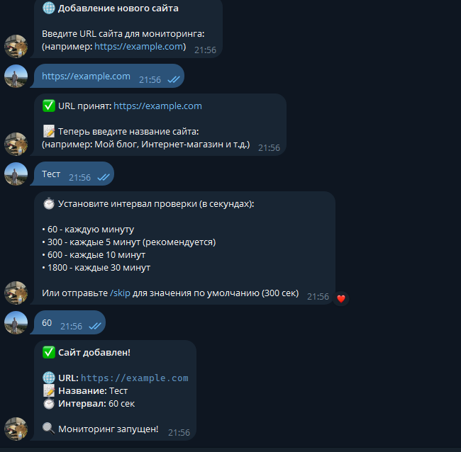
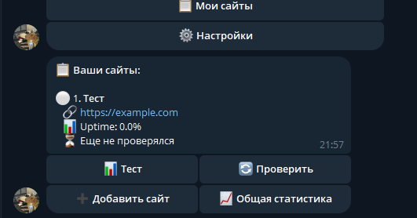
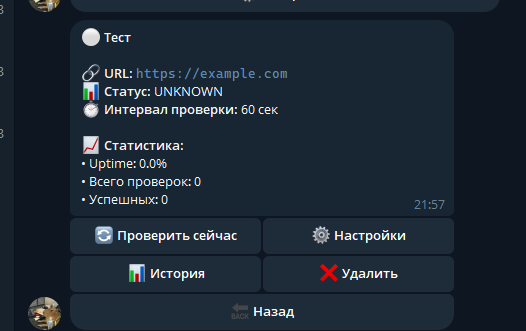
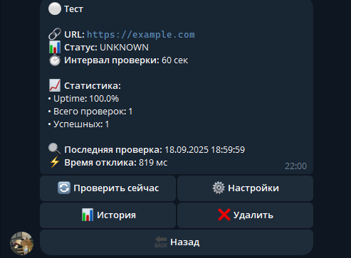
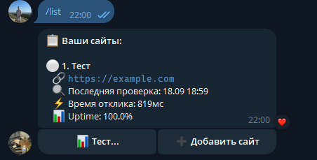

# 🔍 Website Monitor Bot

Telegram бот для мониторинга доступности веб-сайтов с системой уведомлений 24/7.

## 📋 Описание

Этот бот позволяет отслеживать доступность ваших веб-сайтов и мгновенно получать уведомления об изменениях их статуса. Система работает круглосуточно и предоставляет подробную статистику по каждому сайту.

## ✨ Функциональность

### 🌐 Управление сайтами
- ➕ Добавление URL для мониторинга
- 📋 Просмотр списка отслеживаемых сайтов  
- ❌ Удаление сайтов из мониторинга
- ⚙️ Настройка интервала проверки для каждого сайта
- 🔄 Принудительная проверка сайта

### 🔍 Мониторинг
- 🤖 Автоматическая проверка доступности сайтов
- ⏱️ Определение времени отклика
- 🔢 Проверка HTTP статус-кодов
- 🔄 Обнаружение изменений в содержимом (опционально)
- 📊 Расчет uptime/downtime статистики

### 📬 Уведомления
- ⚡ Мгновенные уведомления при недоступности сайта
- ✅ Уведомления о восстановлении работы
- 📊 Еженедельные отчеты о статистике
- ⚙️ Настройка типов уведомлений

### 📈 История и статистика
- 📝 История проверок для каждого сайта
- 📊 Статистика uptime/downtime
- 📉 Графики доступности (текстовые отчеты)
- 📤 Экспорт отчетов

## 🚀 Быстрый старт

1. **Редактирование .env файла:**
```bash
# Обязательные параметры
BOT_TOKEN=ваш_токен_бота
DB_PASSWORD=безопасный_пароль

# Опционально - настройка администраторов
ALLOWED_ADMINS=123456789,987654321
```

2. **Запуск приложения:**
```bash
docker-compose up -d --build
```

3. **Проверка статуса:**
```bash
docker-compose logs -f bot
```

## 🛠️ Конфигурация

### Основные параметры (.env)

| Параметр | Описание | По умолчанию |
|----------|----------|--------------|
| `BOT_TOKEN` | Токен Telegram бота | **Обязательно** |
| `DB_PASSWORD` | Пароль БД | **Обязательно** |
| `DEFAULT_CHECK_INTERVAL` | Интервал проверки (сек) | 300 |
| `REQUEST_TIMEOUT` | Таймаут запроса (сек) | 10 |
| `MAX_RETRIES` | Максимум повторов | 3 |
| `ALLOWED_ADMINS` | ID администраторов | - |

### Настройки уведомлений

| Параметр | Описание | По умолчанию |
|----------|----------|--------------|
| `NOTIFICATION_DELAY` | Задержка между уведомлениями (сек) | 60 |
| `WEEKLY_REPORT_DAY` | День недели для отчета (0-6) | 0 (Пн) |
| `WEEKLY_REPORT_HOUR` | Час отправки отчета (0-23) | 9 |

## 📱 Использование

### Основные команды

- `/start` - Запуск бота и регистрация
- `/add` - Добавить новый сайт
- `/list` - Показать все ваши сайты
- `/stats` - Общая статистика
- `/settings` - Настройки уведомлений
- `/help` - Справка по командам

### Быстрое добавление

Просто отправьте URL боту, и он предложит добавить сайт для мониторинга:
```
https://example.com
```

### Административные команды

- `/admin` - Панель администратора
- `/broadcast` - Рассылка сообщений всем пользователям

## 🏗️ Архитектура

### Структура проекта

```
website-monitor-bot/
├── app/                    # Основное приложение
│   ├── handlers/          # Обработчики команд
│   ├── models/           # Модели базы данных
│   ├── services/         # Бизнес-логика
│   ├── utils/           # Утилиты
│   ├── config.py        # Конфигурация
│   └── main.py          # Точка входа
├── alembic/             # Миграции БД
├── tests/               # Тесты
├── docker-compose.yml   # Docker конфигурация
├── Dockerfile          # Образ приложения
└── requirements.txt    # Зависимости Python
```

### Технологический стек

- **Python 3.12** - Основной язык
- **aiogram 3.8** - Telegram Bot API
- **SQLAlchemy 2.0** - ORM для работы с БД
- **PostgreSQL 16** - База данных
- **aiohttp** - HTTP клиент для проверок
- **Docker** - Контейнеризация
- **Alembic** - Миграции БД

## 📊 База данных

### Основные таблицы

- `users` - Пользователи бота
- `user_settings` - Настройки пользователей
- `websites` - Отслеживаемые сайты
- `health_checks` - История проверок
- `incidents` - Инциденты недоступности
- `notifications` - Отправленные уведомления

## 📋 Changelog

### v1.0.0 (2024-09-18)
- ✨ Первый релиз
- 🔍 Базовый мониторинг сайтов
- 📬 Система уведомлений
- 📊 Статистика и отчеты
- 🐳 Docker поддержка
- 👥 Административная панель

## 📸 Скриншоты













